# FacebookPhoto
La web app nella repository permette di ottenere dati riguardanti la data di caricamento delle foto su facebook da un utente, i dati vengono importati tramite chiamata https://graph.facebook.com/v7.0/me?fields=photos?fields=photos&access_token=ACCESTOKEN nel seguente formato, 
```

    "photos": {
        "data": [
            {
                "created_time": "2018-11-28T23:00:16+0000",
                "id": "2091266917588916"
            },
            {
                "created_time": "2018-11-28T23:00:16+0000",
                "id": "2091265640922377"
            },
            {
                "created_time": "2016-10-24T19:04:26+0000",
                "id": "1304188279630121"
            },
            {
                "created_time": "2016-10-03T18:44:10+0000",
                "id": "1794642804139574"
            },
            {
                "created_time": "2016-10-03T18:40:51+0000",
                "id": "1794640467473141"
            }
        ],
        "paging": {
            "cursors": {
                "before": "QVFIUjFzdGZAtZAlpaYnFvbDl3aGJuMGJKU2RZAQVNIMzNPRWp4RGFrLWUxS0g2Um1FSlhKSm4tQUdManRWejBMVGlCVkxEUm9sQW1jYUprQ1hUY1BvRTY0SkZAB",
                "after": "QVFIUlE2elFvVXcxTFlMWHRjSjd6MDN5YmF4UU44cVJzME05eTlhVHFuMG9sRDVSV2c1cXB1ak12Q3J3WWliS096V1BNY2dlVFNvSFpBTUN4R1VkR1dmWXl3"
            }
        }
    ,
    "id": "3124567366680310"
   }
   ```
 Tuttavia, di tutti questi dati gli unici che ci interessa analizzare sono quelli contenuti nel vettore data(created_time e id), ci sarà quindi una parte del programma che eliminerà le parti superflue 
 
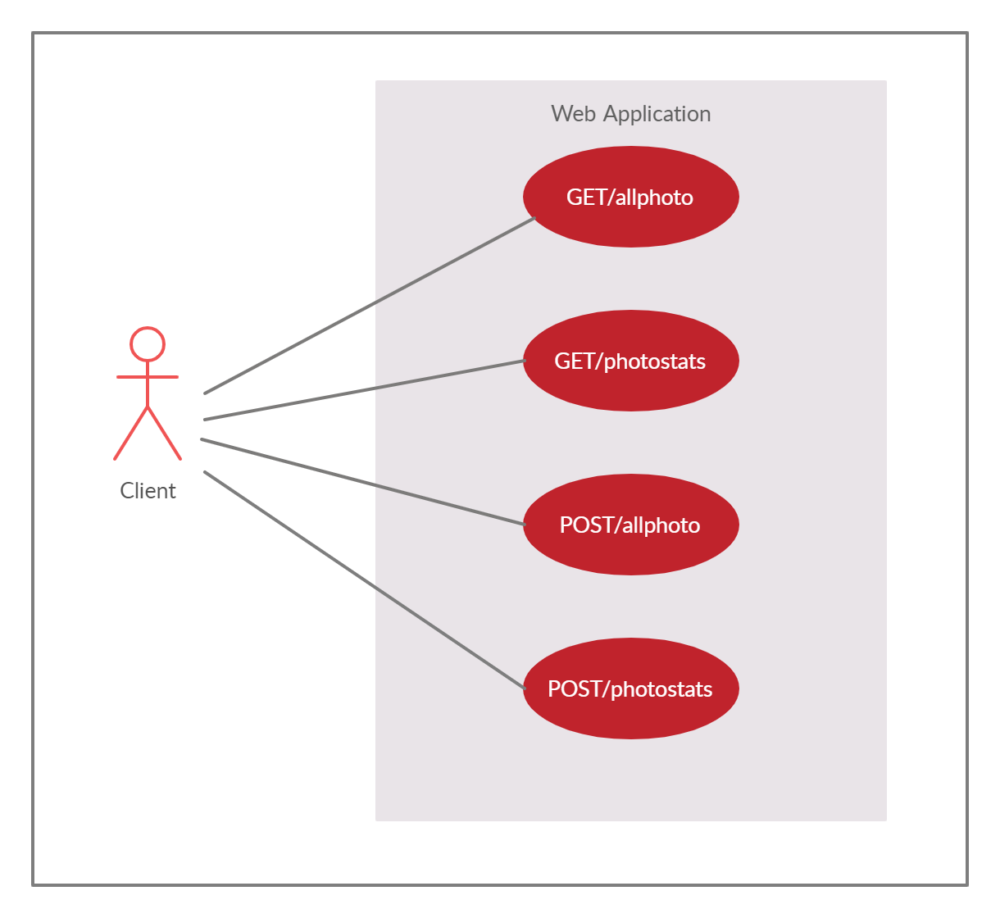

## Richieste disponibili 
Una volta scaricata la SpringBootApp e avviata tramite eclipse oppure direttamente da linea di comando tramite `mvn package` basta mettersi in ascolto sulla porta http://localhost:8080.
le richieste disponibili sono le seguenti 
|    TIPO        |rotta                          |descrizione                                |
|----------------|-------------------------------|-------------------------------------------|
|GET             |/allphoto                     |restituisce tutte le foto caricate            |
|GET             |/photodata                          |restituisce le statistiche sulle foto caricate                |
|POST            |/allphoto                          |restituisce le foto caricate  rispettano il filtri specificato nella richiesta                                     |
|POST            |/photodata      |restituisce le statistiche sulle foto caricate rispettano il filtri specificato nella richiesta  |

## Filtri Disponibili 
| Nome operatore | Descrizione                                |Esempio                                     |
|----------------|--------------------------------------------|--------------------------------------------|
|Follow          |"successivi a..."                           |{"Year":{"Follow":2016}} / {"Month":{"Follow":["giu"]}} |
|Previous        |"precedenti a..."                           |{"Year":{"Previous":2016}}    |
|Equal           |"corrisponde a..."                          |{"Year":{"Equal":2016}} / {"Dayname":{"Equal":["lunedì"]}}|
|Nequal          |"non corrisponde a..."                      |{"Year":{"Nequal":2016}} / {"Dayname":{"Nequal":["lunedì"]}}     |

# Struttura Programma 
## Package 
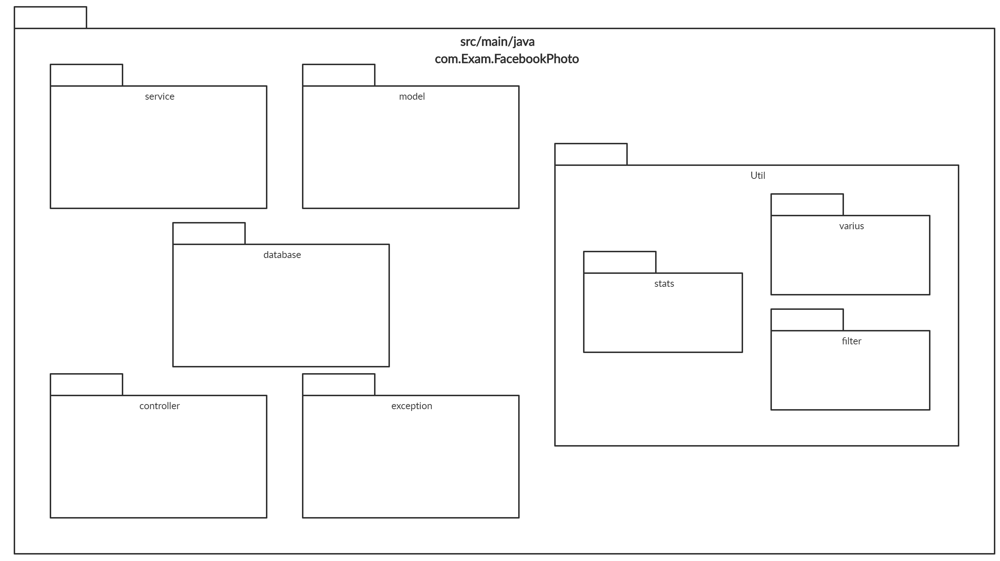
## Model
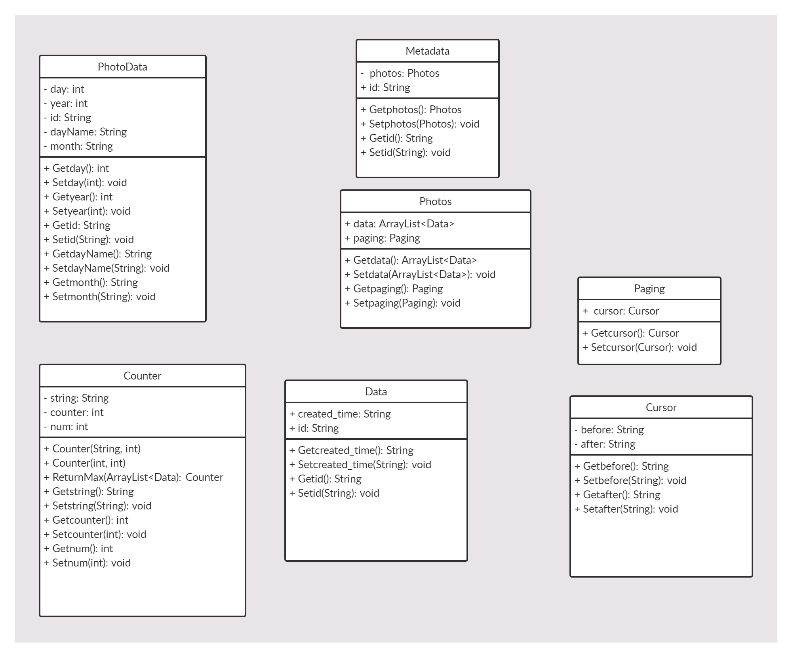
## Database
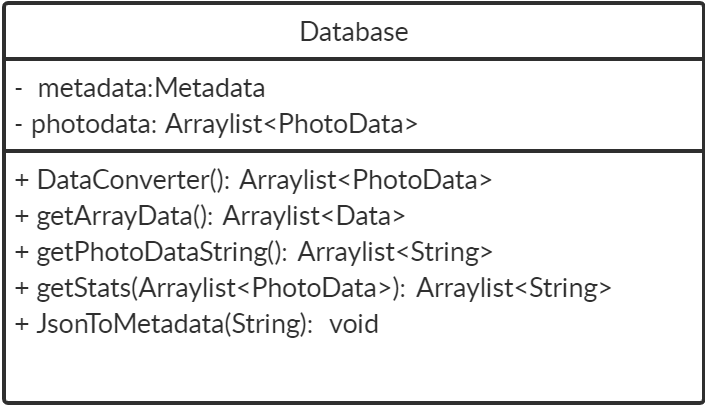
## Service
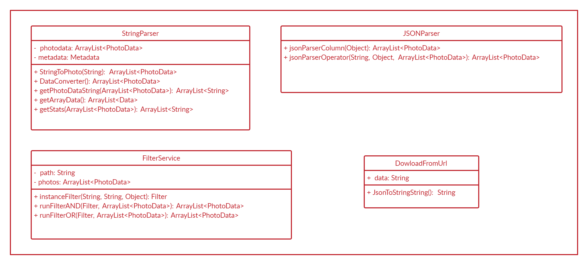
## Controller

## Exception
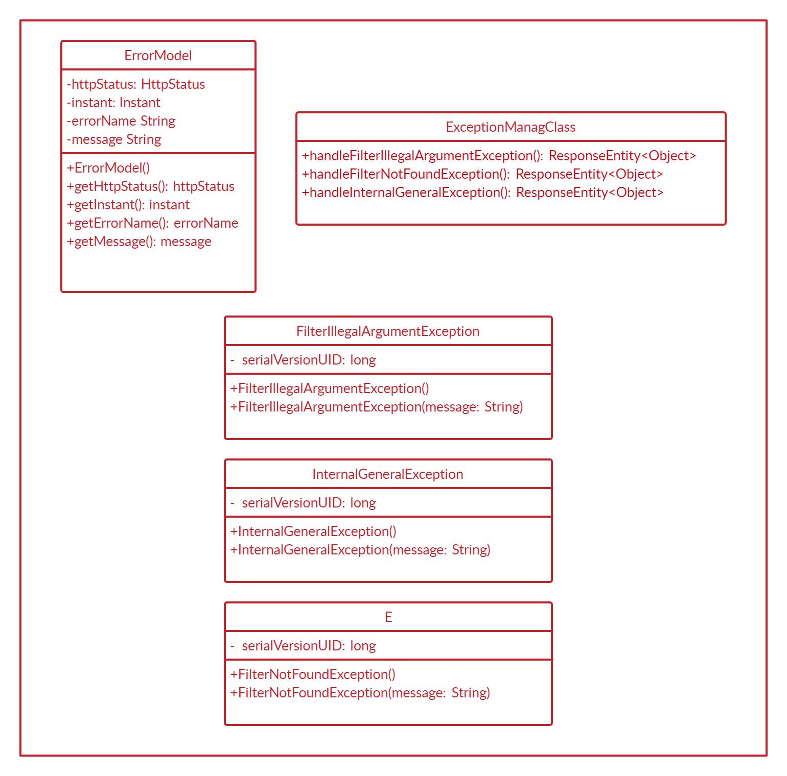
## Various
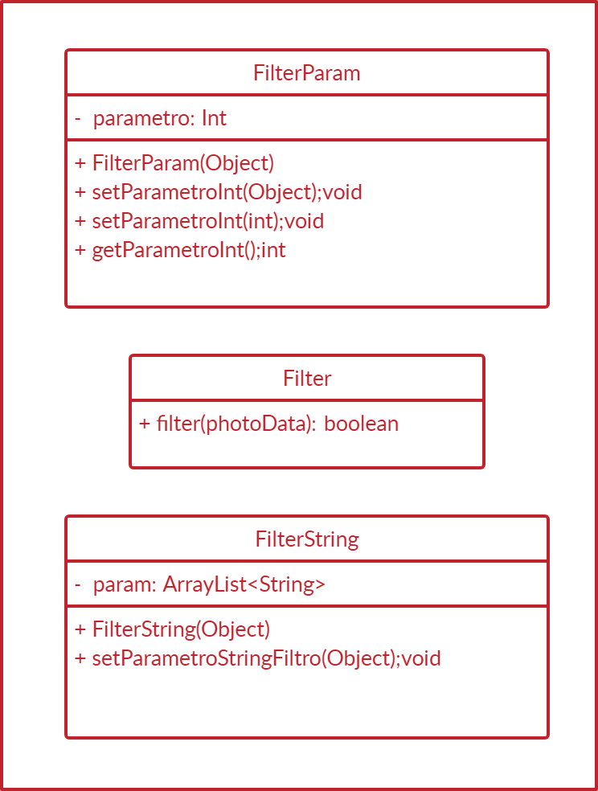
## Stats
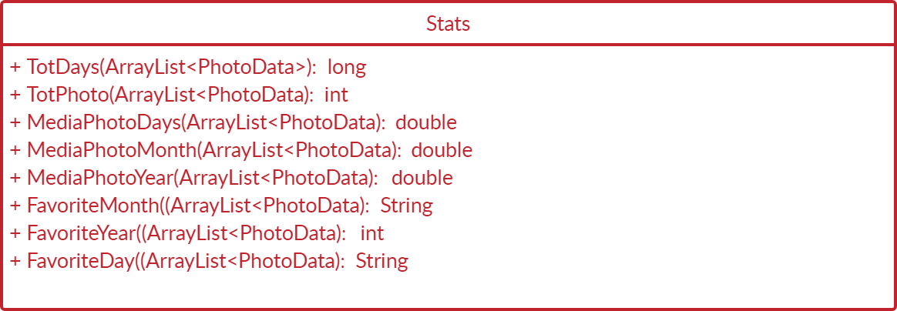
## Filter
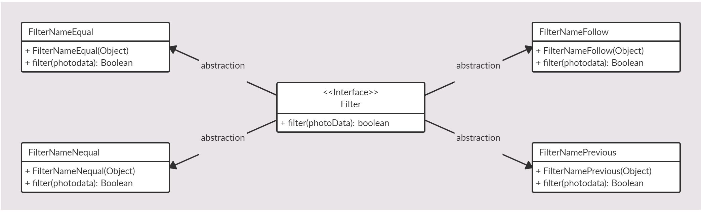
# Diagramma delle sequenze
## GET/allphoto
**Chiamata GET/allphoto** Il Controller esegue una chiamata tramite il metodo getPhotoDataString, il quale
inizializza un ArrayList PhotoData, lo converte in ArrayList String (con i parametri separati quindi più facili
da trattare) e lo restituisce.
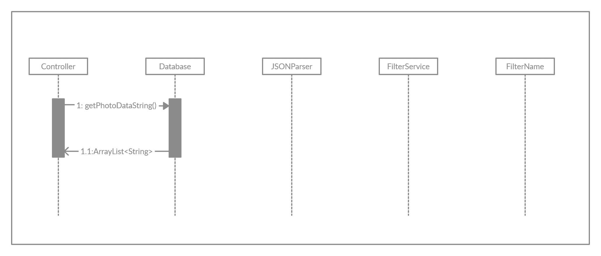
## POST/allphoto
**Chiamata POST/allphoto** Il Controller esegue una chiamata tramite getPhotoDataString alla classe JsonParser.
Le classi jsonParserColumn e jsonParserOperator effettueranno il parsing e ricaveranno le informazioni
relative al filtraggio. Queste ultime verranno utilizzate da instanceFilter che instanzierà filtri 
presi dalle classi contenute nel package com.Exam.FacebookPhoto.util.filter. Il filtraggio avverrà tramite
runFilter che restituirà l'ArrayList, anch'esso in formato String.
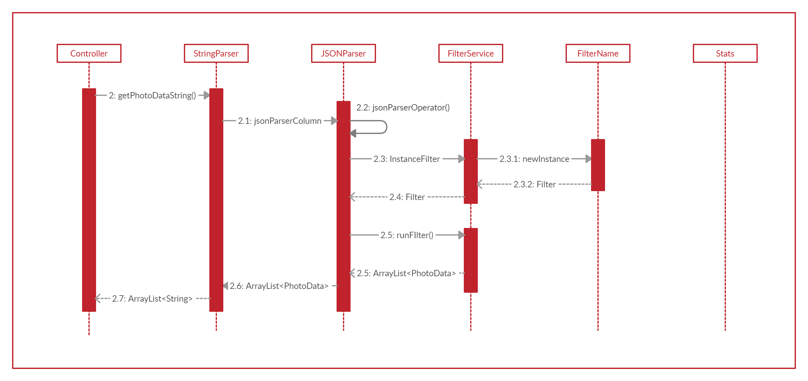
## GET/photostats
**Chiamata GET/photostats** Il Controller esegue una chiamata tramite getStats, il quale genererà un
ArrayList String con ad ogni suo elemento una statistica ottenuta tramite chiamata in Stats.
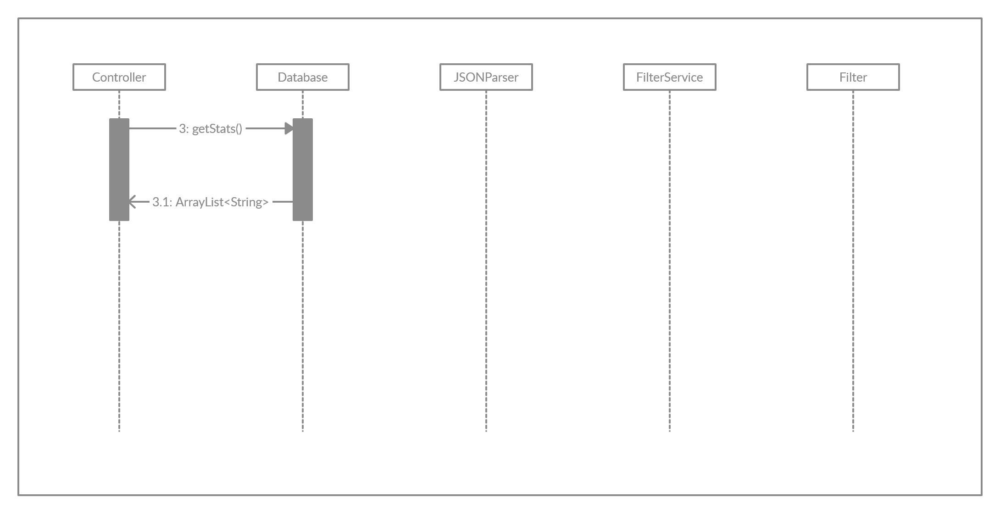
## POST/photostats
**Chiamata POST/photostats** Il Controller esegue una chiamata tramite getPhotoDataString alla classe JsonParser.
Le classi jsonParserColumn e jsonParserOperator effettueranno il parsing e ricaveranno le informazioni
relative al filtraggio. Queste ultime verranno utilizzate da instanceFilter che instanzierà filtri 
presi dalle classi contenute nel package com.Exam.FacebookPhoto.util.filter. Il filtraggio avverrà tramite
runFilter che restituirà l'ArrayList. Verrà effettuata la chiamata getStats la quale genererà un ArrayList String
con ad ogni suo elemento una statistica ottenuta tramite chiamata in Stats.
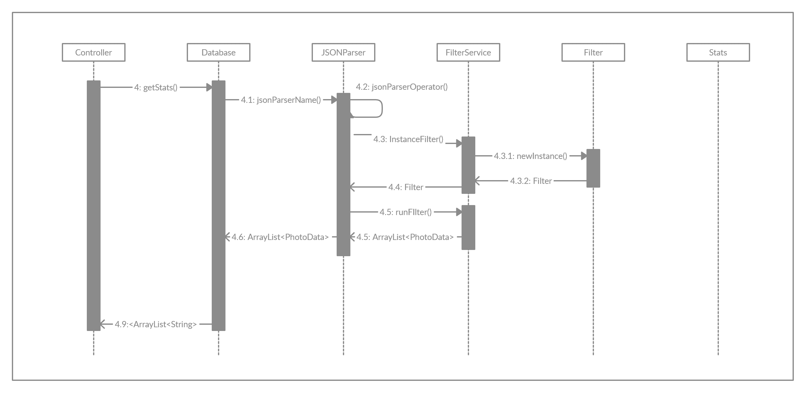
## Nota
Abbiamo deciso, per facilitare la visualizzazione dei dati, di formattare le risposte delle quattro richieste disponibili come stringhe. Ciò non toglie che con
una piccola modifica è possibile cambiare il formato dei dati esportati in un altro desiderato, ad esempio il JSON.
## Generazione Javadoc
Vista la presenza di una documentazione Javadoc non aggiornata e l'impossibilità di poterne caricare una nuova, si consiglia la generazione di un nuovo Javadoc attraverso i seguenti passi:
* Su Eclipse, andare su Project -> Generate Javadoc.
* Spuntare il relativo progetto di cui si vuole generare il Javadoc e verificare il percorso di destinazione dei file, poi cliccare su "Finish".
* Cliccare su "Yes to all" nella successiva finestra popup.
## Autori
**Andrea Marcheggiani** - [GitHub](https://github.com/Coccia97)

**Contributi** 
* Stats
* Model
* Controller

**Francesco Columbaro** - [GitHub](https://github.com/FrancescoColumb)

**Contributi** 
* Filter
* Exceptions
* Varius

Le parti restanti sono state curate da entrambi.

