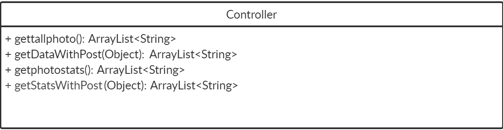
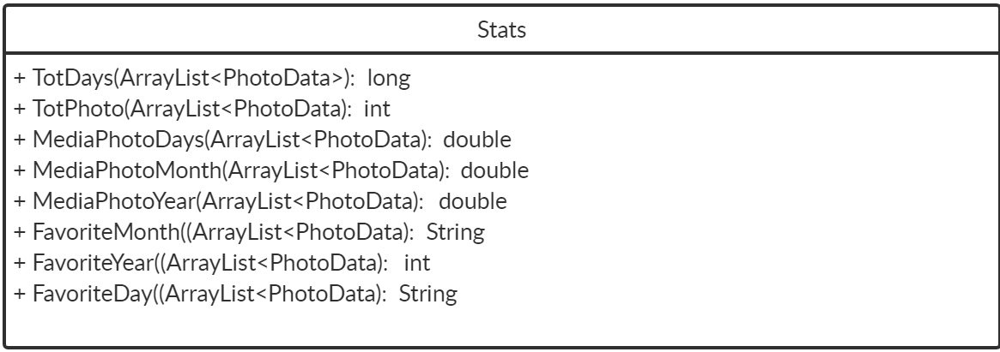

# FacebookPhoto
La web app nella repository permette di ottenere dati riguardanti la data di caricamento delle foto su facebook da un utente, i dati vengono importati tramite chiamata https://graph.facebook.com/v7.0/me?fields=photos?fields=photos&access_token=ACCESTOKEN nel seguente formato, 
```

    "photos": {
        "data": [
            {
                "created_time": "2018-11-28T23:00:16+0000",
                "id": "2091266917588916"
            },
            {
                "created_time": "2018-11-28T23:00:16+0000",
                "id": "2091265640922377"
            },
            {
                "created_time": "2016-10-24T19:04:26+0000",
                "id": "1304188279630121"
            },
            {
                "created_time": "2016-10-03T18:44:10+0000",
                "id": "1794642804139574"
            },
            {
                "created_time": "2016-10-03T18:40:51+0000",
                "id": "1794640467473141"
            }
        ],
        "paging": {
            "cursors": {
                "before": "QVFIUjFzdGZAtZAlpaYnFvbDl3aGJuMGJKU2RZAQVNIMzNPRWp4RGFrLWUxS0g2Um1FSlhKSm4tQUdManRWejBMVGlCVkxEUm9sQW1jYUprQ1hUY1BvRTY0SkZAB",
                "after": "QVFIUlE2elFvVXcxTFlMWHRjSjd6MDN5YmF4UU44cVJzME05eTlhVHFuMG9sRDVSV2c1cXB1ak12Q3J3WWliS096V1BNY2dlVFNvSFpBTUN4R1VkR1dmWXl3"
            }
        }
    ,
    "id": "3124567366680310"
   }
   ```
 Tuttavia, di tutti questi dati gli unici che ci interessa analizzare sono quelli contenuti nel vettore data(created_time e id), ci sarà quindi una parte del programma che eliminerà le parti superflue 
 


## Richieste disponibili 
Una volta scaricata la SpringBootApp e avviata tramite eclipse oppure direttamente da linea di comando tramite `mvn package` basta mettersi in ascolto sulla porta http://localhost:8080.
le richieste disponibili sono le seguenti 
|    TIPO        |rotta                          |descrizione                                |
|----------------|-------------------------------|-------------------------------------------|
|GET             |/allphoto                     |restituisce tutte le foto caricate            |
|GET             |/photodata                          |restituisce le statiche sulle foto caricate                |
|POST            |/allphoto                          |restituisce le foto caricate  rispettano il filtri specificato nella richiesta                                     |
|POST            |/photodata      |restituisce le statiche sulle foto caricate rispettano il filtri specificato nella richiesta  |

## Filtri Disponibili 
| Nome operatore | Descrizione                                |Esempio                                     |
|----------------|--------------------------------------------|--------------------------------------------|
|     |        |             |
|         |           |            |
|      |       |    |     
|     |     |     |

# Struttura Programma 
## Package 

## Model

## Service

## Controller

## Exception

## Various

## Stats

## Filter

